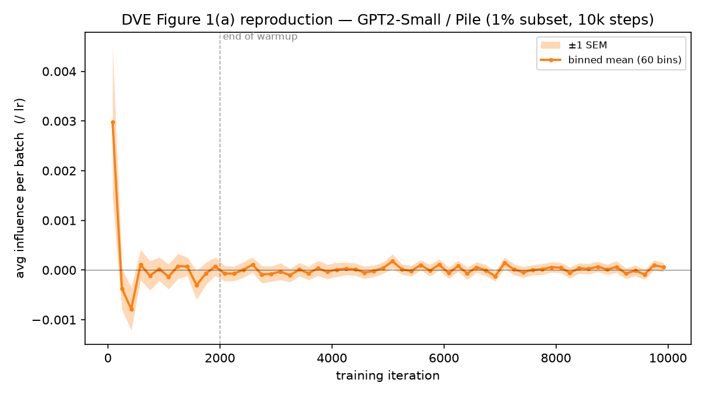

# DVE temporal influence — GPT-2 on Pile

Average per-batch data-value-embedding influence on the final model's validation loss, plotted
against training iteration (GPT2-Small, 1% of Pile, 10k steps, MLP-only projected gradients,
`lr_mode=scaled`, 256 val windows). The influence is normalized by each batch's learning rate.



## Launch

Set the Pile data dirs (per-domain GPT-2 `.bin` files; see `examples/dve_lm/README.md`), then run
the pipeline and plot:

```bash
export PILE_DATA_DIR_TRAIN=/path/to/pile/pile-train
export PILE_DATA_DIR_VAL=/path/to/pile/pile-val-gpt2
export PILE_DATA_DIR_TEST=/path/to/pile/pile-test-gpt2

# train + capture -> embeddings -> value matrix  (~1 h on an H200; outputs are gitignored)
python examples/dve_lm/main.py --data_source pile --architecture GPT2-Small --device cuda \
    --optimizer adamw --learning_rate 3e-4 --lr_schedule linear \
    --warmup_steps 2000 --max_steps 10000 --lr_decay_steps 10000 \
    --batch_size 16 --n_test 256 --weight_decay 0.01 --beta1 0.9 --beta2 0.999 \
    --proj_layers mlp --proj_rank_total 256 --lr_mode scaled \
    --train_and_store_grad --compute_embedding --compute_value

# plot from the value matrix (re-plot cheaply with --from_csv <prefix>_perstep.csv)
python examples/dve_lm/experiments/plot_fig1a.py \
    --values examples/dve_lm/results/<run>/value/values.pt --out dve_fig1a_2026-06-30 \
    --lr_mode scaled --learning_rate 3e-4 --warmup_steps 2000 \
    --max_steps 10000 --lr_decay_steps 10000 --lr_schedule linear --bins 60
```
