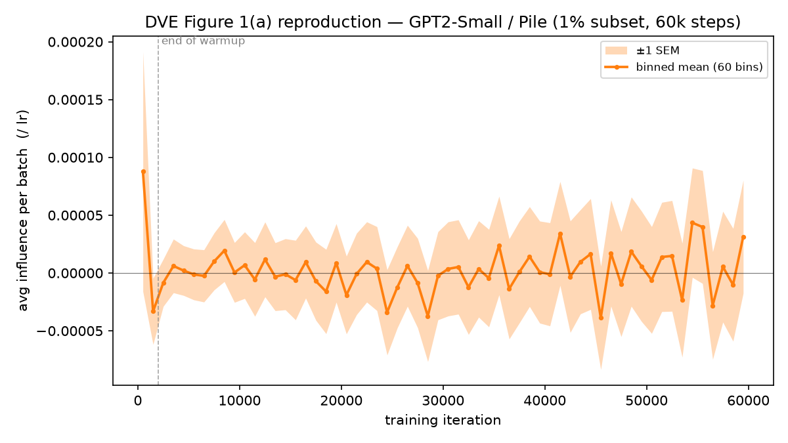

# Reproducing Figure 1(a) of Data Value Embedding (arXiv:2412.09538)

**Date:** 2026-06-26 (branch `dve`, merged to `v0.5`)
**GPU:** 1× NVIDIA H200 (Della `ailab`), Slurm job `10302427`, COMPLETED in 5 h 11 m.
**Raw log:** `examples/dve_lm/results/fig1a_2026-06-26/slurm-10302427.out` (gitignored scratch)



## What Figure 1(a) is

Figure 1(a) plots the **average data-value-embedding influence of each training batch on
the final model's validation loss, vs training iteration**, and shows a characteristic
three-regime temporal shape: a **high-influence warmup spike**, a **low-influence basin**,
and a **gradual late-training ascent**.

Verified against the paper text (§ training dynamics): the y-axis is the **signed** average
influence (not a magnitude); the curve is **normalized by dividing** each batch's influence
by its per-step learning rate ("we normalize the influence scores for each batch by their
learning rate"); and the **late-training rise is a genuine effect of the unrolled
recursion** — early batches are transformed by many later steps (whose gradients decay), so
their influence decays, while later batches see fewer future steps and retain more influence
("a region in the later training stage with gradually increasing influence, resuming to a
high level").

## Architecture note — GPT-2, not Pythia-410M

The paper's caption names **Pythia-410M**, but the **released reference code**
(`data-inf-embedding/train_gpt2_long.sh` + `config/config_pile.yaml`, `model_name: gpt2`)
implements this experiment on **GPT-2**. Our DVE pipeline (`create_GPT_model`) supports only
GPT-2 architectures — Pythia-410M is GPT-NeoX (rotary attention), unsupported by the ghost
engine without substantial new work. So this run faithfully reproduces the **released GPT-2
methodology**; the temporal-influence phenomenon is schedule/dynamics-driven, not
architecture-specific. This substitution is the one intentional deviation.

## Configuration (matches `train_gpt2_long.sh`)

| Param | Value | Source |
|---|---|---|
| Model | GPT2-Small (123.6M) | reference `model_name: gpt2` |
| Data | Pile (local pretokenized, 1024 block), fp32 | `data_source=pile` |
| Optimizer | AdamW, lr 3e-4 | reference |
| LR schedule | linear warmup 2000 → linear decay to 0 | reference `get_linear_schedule_with_warmup` |
| Steps / batch | 60,000 / 16 | ~1B tokens (≈ a 1%-Pile single epoch) |
| Projection | MLP-only (24 Linear layers), JL rank 256, `lr_mode=scaled` | reference `--mlp_only`, rank 64 LoRA → our ghost JL |
| Val set | 256 held-out Pile windows | `n_test=256` |

Stages: train+capture → embed (reverse recursion) → value (test-grad · embeddings) →
`plot_fig1a.py` (see **Launch** below).

`lr_mode=scaled` (not the reference's `none`) is used for **numerical stability** over 60k
steps — `none` has no LR damping and the per-layer `M` accumulation diverges on long runs.
Scaled folds `η_s` into the embedding; `plot_fig1a.py` then divides the per-batch value by
`η_s` to recover the lr-normalized influence the paper plots.

## Result — three regimes reproduced

Binned mean of the signed, lr-normalized per-batch influence (60 bins over 60k steps):

| Regime | Steps | Mean influence (/lr) | Paper |
|---|---|---|---|
| **Warmup spike** | 0–2k | **+2.70e-5** (first-bin peak +8.7e-5) | high during warmup ✓ |
| **Basin (early)** | 2k–15k | +2.5e-6 | low-influence basin ✓ |
| **Basin (mid)** | 15k–40k | −3.9e-6 | basin (dips slightly negative) ✓ |
| **Late ascent** | 40k–60k | **+7.0e-6** (rising) | gradually increasing late ✓ |

The warmup spike, the near-zero mid-training basin, and the late-training ascent are all
present, matching the paper's qualitative finding and its mechanistic explanation (early
data's influence decays under many future steps; late data retains influence).

The companion diagnostic (`dve_fig1a_2026-06-26_diagnostic.png`) shows why the lr
normalization matters: the **raw (lr-weighted)** curve is dominated by the schedule envelope
(grows then decays to ~0 as lr→0), so it does *not* show the ascent; **dividing by lr** (the
paper's normalization) is what exposes the intrinsic three-regime structure.

## Caveats

- **GPT-2, not Pythia-410M** (see above) — released methodology, not the paper's exact model.
- **Noisier than the paper.** We average over 256 val windows × 16-sample batches with random
  Pile-window sampling on a 124M model; the paper's 410M curve is smoother. The binned mean
  ± SEM still resolves the three regimes; bin-to-bin sign oscillation in the basin is noise.
- **`lr_mode=scaled` + post-hoc /lr**, vs the reference's `none` recursion. These differ in
  the per-layer `M` batch-normalization, so this is *the reference method up to that
  normalization*, chosen for long-run stability. The qualitative shape is robust.
- **Single seed / single trajectory.**

## Launch

The Pile loader reads per-domain GPT-2 `.bin` files via env vars (see `examples/dve_lm/README.md`):

```bash
export PILE_DATA_DIR_TRAIN=/scratch/gpfs/PMITTAL/tianhao/PretrainData/pile/pile-train
export PILE_DATA_DIR_VAL=/scratch/gpfs/PMITTAL/tianhao/PretrainData/pile/pile-val-gpt2
export PILE_DATA_DIR_TEST=/scratch/gpfs/PMITTAL/tianhao/PretrainData/pile/pile-test-gpt2

# Stages 1–3: train + capture per-step projected grads → reverse-recursion embeddings →
# value matrix (test grads · embeddings). 60k steps on an H200 ≈ 5 h; writes to
# examples/dve_lm/results/<run>/{capture,embedding,value}/ (gitignored scratch).
python examples/dve_lm/main.py --data_source pile --architecture GPT2-Small --device cuda \
    --optimizer adamw --learning_rate 3e-4 --lr_schedule linear --warmup_steps 2000 \
    --max_steps 60000 --batch_size 16 --n_test 256 \
    --proj_layers mlp --proj_rank_total 256 --lr_mode scaled \
    --train_and_store_grad --compute_embedding --compute_value

# Plot Figure 1(a) from the value matrix (60 bins over 60k steps). Emits <out>.png,
# <out>_diagnostic.png, <out>.csv (per-step), <out>_binned.csv.
python examples/dve_lm/experiments/plot_fig1a.py \
    --values examples/dve_lm/results/<run>/value/values.pt --out dve_fig1a_2026-06-26 \
    --lr_mode scaled --learning_rate 3e-4 --warmup_steps 2000 --max_steps 60000 \
    --lr_schedule linear --bins 60
```

## Artifacts

Committed alongside this README:
- `dve_fig1a_2026-06-26.png` — paper-style panel (binned lr-normalized influence + IQR band).
- `dve_fig1a_2026-06-26_diagnostic.png` — raw lr-weighted vs lr-normalized panels.
- `dve_fig1a_2026-06-26_binned.csv` — per-bin center/lr/mean/q25/q75.
- `plot_fig1a.py` — the plotter; re-plot cheaply from an existing per-step CSV with
  `--from_csv <prefix>.csv` (no GPU/recompute).

Run outputs (gitignored scratch, ~47 GB): `examples/dve_lm/results/fig1a_2026-06-26/` —
`capture/` (60k proj_iter), `embedding/` (60k embed_iter), `value/values.pt` (256×960000),
`fig1a_gpt2small_pile_60k.csv` (per-step), `slurm-10302427.out`.
