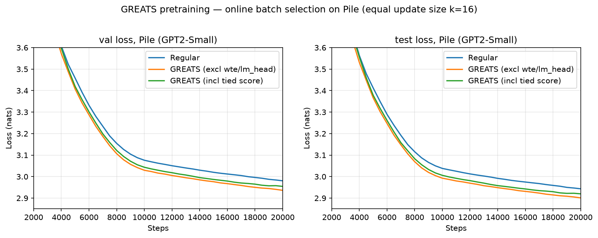

# GREATS pretraining: online batch selection on Pile

Held-out Pile loss for training on a **random** batch (Regular) vs **GREATS** online batch
selection — GPT2-Small, **equal update size `k=16`** (every arm steps on 16 samples; GREATS
selects the best 16 of a 32-candidate pool by the train↔val gradient dot product `<g_i, g_val>`).



## Result
**GREATS < Regular** on held-out Pile val/test loss at equal update size — the gain is purely
selection quality (best-16-of-32 vs random-16). Excluding the tied `wte`/`lm_head` term from the
*score* helps: it dominates the raw score but is a weaker selection signal (the score is computed
correctly either way; `excl` just selects better). Final loss at step 20000:

| arm | val | test |
|---|---:|---:|
| Regular | 2.981 | 2.943 |
| **GREATS — excl wte/lm_head** (recommended) | **2.936** | **2.901** |
| GREATS — incl (full tied score) | 2.955 | 2.920 |

The arms separate by ~step 2500 and the gap holds through 20k.

## Setup
GPT2-Small (124M, tied `wte`/`lm_head`, `bias=False`), Pile, seq_len 1024, fp32 model / bf16
train, lr 6e-4 (cosine, warmup 2000), 20k steps, eval every 500. GREATS: candidate pool `N=32`,
select `k=16`, scoring val `m=16` drawn from the fixed eval-window pool.

## Launch
```bash
cd examples/greats/pretrain          # run_compare.sbatch sets PILE_DATA_DIR_* internally
sbatch experiments/run_compare.sbatch Regular no   20000   # random-16 baseline
sbatch experiments/run_compare.sbatch GREATS  excl 20000   # --score_exclude_params wte,lm_head
sbatch experiments/run_compare.sbatch GREATS  incl 20000   # full tied score

# regenerate the figure from the raw run logs in ./logs/
.venv/bin/python examples/greats/pretrain/experiments/plot_greats_pretrain_loss.py
```

## Provenance
A100-SXM4-80GB, GhostSuite `.venv`, bf16 train, seed 42; single run per arm (the cross-arm gap
is consistent across all 40 eval points). Raw run logs under `logs/`. This comparison was run on
the original (eager, ghost-update) GREATS with the recommended `excl` arm, which is unaffected by
the later tied-weight `grad_val` scoring-only fix.
