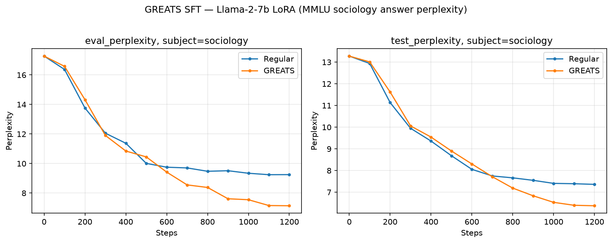

# GREATS SFT: online selection for LoRA instruction tuning

MMLU answer perplexity for **Regular** vs **GREATS** online batch selection during Llama-2-7b
LoRA instruction tuning (subject `sociology`; answer perplexity is the upstream `trialrun.png`
metric).



## Result
**GREATS < Regular** — final **test ppl 6.38 vs 7.36** (−13%) and **eval ppl 7.14 vs 9.25**
(−23%), *while updating on half the per-step data* (GREATS selects `k=2` of `N=4`; Regular trains
on 4). The curves track early, then Regular plateaus (~step 700) while GREATS keeps dropping — the
gap widens over training, mirroring upstream.

| step | Regular test_ppl | GREATS test_ppl |
|---:|---:|---:|
| 200 | 11.14 | 11.62 |
| 600 | 8.06 | 8.30 |
| 1000 | 7.41 | 6.53 |
| **1200** | **7.36** | **6.38** |

## Setup
Llama-2-7b-hf, bf16; peft LoRA r=128 / alpha=1 / dropout=0.1 on `q,k,v,o_proj`; lr 2e-5, linear
schedule, warmup 0.03, `max_seq_length=512`, label masking on (loss on assistant completions).
Data: LESS instruction corpora (flan_v2/cot/dolly/oasst1), ~4849-sample slice, 1 epoch = 1200
steps, eval every 100. Selection: candidates `N = fracinv·k`; Regular trains on `k=4`/step, GREATS
selects `k=2` of `N=4` (`fracinv 2.0`). Metric: MMLU sociology answer perplexity
(`exp(mean CE on the masked-prompt answer token)`) on the `n_val=5` dev and `n_test=201` test sets.

## Launch
```bash
cd examples/greats/sft
sbatch experiments/run_compare.sbatch Regular 4 1.0
sbatch experiments/run_compare.sbatch GREATS  2 2.0 first_order

# regenerate the figure from the raw run logs in ./logs/
.venv/bin/python examples/greats/sft/experiments/plot_greats_sft_ppl.py
```

## Notes
- The figure shows the **first-order** GREATS arm (top-k by `<g_i, g_val>`, labelled "GREATS").
  A second-order Gram/redundancy variant (`sbatch experiments/run_compare.sbatch GREATS 2 2.0
  second_order`) also exists and is validated against autograd (~1e-7), but adds no clear win at
  this tiny candidate pool (`N=4`, select 2) — there is little redundancy to remove; it should
  matter more with larger `fracinv`.
- Provenance: H200, GhostSuite `.venv`, seed 11; single run per arm. Raw run logs under `logs/`.
