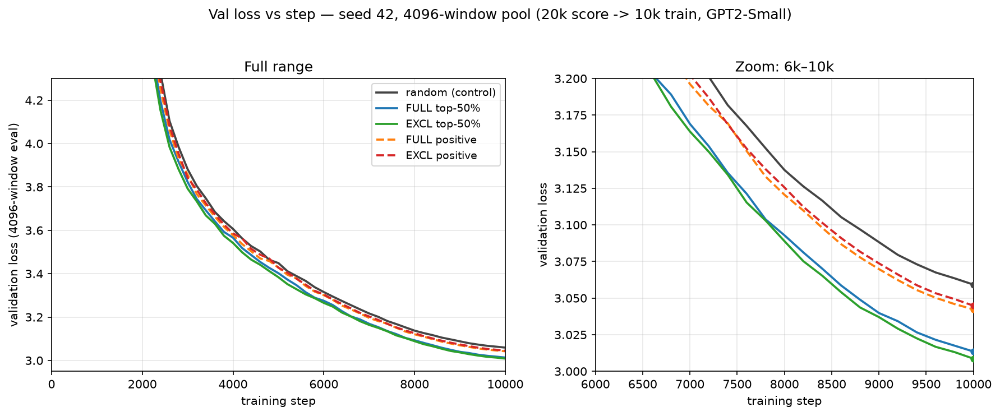

# sel50: gradient-dot-product data selection

Validation loss for training on **random** vs **gradient-dot-product–selected**
data (GPT2-Small, Pile; 20k-step scoring → 10k-step training).



## Launch

The scripts default to `EVAL_ITER=256` and `seed=42`; override them via the
`EVAL_ITER` env var or the trailing seed argument if needed.

```bash
cd examples/lm/graddotprod_lm

# 1. Scoring runs (GradDotProd, 20k steps): full score + a wte/lm_head-excluded score
full=$(sbatch --parsable experiments/sel50/score_fixed.sbatch score_full ""           20000)
excl=$(sbatch --parsable experiments/sel50/score_fixed.sbatch score_excl "wte,lm_head" 20000)

# 2. Selection arms (top-50% + positive, 10k steps) — run after each scoring job
sbatch --dependency=afterok:$full experiments/sel50/select_driver.sbatch score_full sel_full 10000
sbatch --dependency=afterok:$excl experiments/sel50/select_driver.sbatch score_excl sel_excl 10000
```
