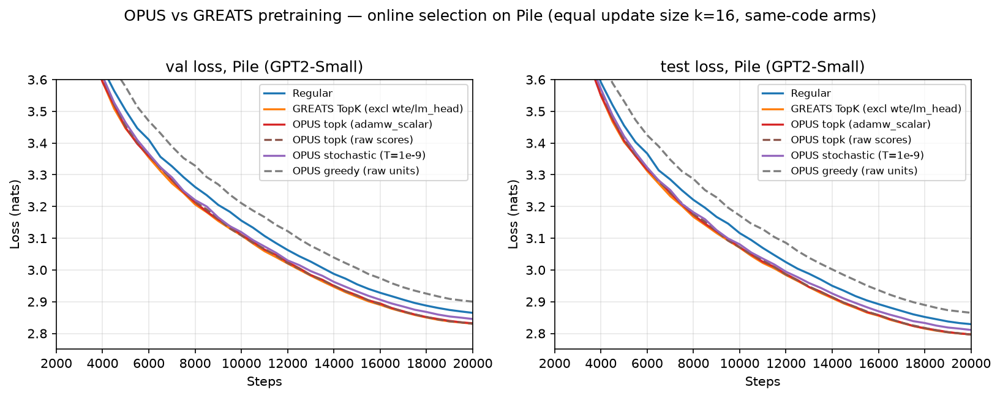

# OPUS vs GREATS pretraining: online selection on Pile

Held-out Pile loss for **OPUS** selection (this example, re-implementing
[github.com/gszfwsb/OPUS](https://github.com/gszfwsb/OPUS)) vs **GREATS** TopK vs **Regular**
(random batch) — GPT2-Small, equal update size `k=16` (every arm steps on 16 samples; the
selection arms pick them from a 32-candidate pool scored against an m=16 proxy batch drawn
from the eval window pool). **All six curves are same-code runs**: the Regular / GREATS
baselines were re-run alongside the OPUS arms because the logs of the earlier GREATS
experiment (2026-06-25) predate an LR-schedule fix — the old config hardcoded a 10k-step
cosine horizon, flatlining at min-lr for the second half of a 20k run — and are therefore
not comparable with newer runs.



## Result — final loss at step 20000

| arm | selection rule | val | test |
|---|---|---:|---:|
| **OPUS topk (raw scores)** | TopK on sketched raw dots | **2.830** | **2.796** |
| **GREATS (excl wte/lm_head)** | TopK on exact raw dots | **2.831** | **2.797** |
| **OPUS topk (adamw_scalar)** | TopK on sketched preconditioned dots | **2.832** | **2.797** |
| OPUS stochastic (adamw_scalar, T=1e-9) | Boltzmann sampling, calibrated T | 2.845 | 2.811 |
| Regular | random 16 | 2.865 | 2.829 |
| OPUS greedy (raw units) | greedy w/ Gram redundancy penalty | 2.900 | 2.865 |

## Findings

1. **Sketched scoring matches exact scoring.** OPUS-topk on 8192-dim/layer gradient sketches
   ties GREATS TopK on exact ghost dot products (Δval ≤ 0.002, within single-run noise) — the
   factorized projection loses nothing in selection quality (score fidelity vs exact was
   Spearman 0.995 at this seq length), while its scoring pass costs the same as GREATS's
   (~0.197 s/step on H200) and is 5–6× faster than the OPUS reference implementation's own
   scoring (see the main [example README](../README.md) for the measured numbers).
2. **The whole selection gain is first-order quality + hard TopK** (~0.034 nats over Regular
   at this protocol). OPUS's additions on top of TopK do not help here:
   - *Optimizer-induced scalars* (`adamw_scalar`, OPUS's `C_t/√numel` layer weighting):
     neutral (2.832 vs 2.830).
   - *Boltzmann stochasticity* (temperature calibrated to the observed score std — the
     reference default T=0.9 would sample uniformly at this score scale): keeps only ~60% of
     the TopK gain (2.845).
   - *Gram diversity penalty*: at a scale where it meaningfully bites (raw units), greedy
     selection is **worse than random** (2.900) — it over-diversifies into low-utility
     candidates. At the reference implementation's own published scale the penalty is a
     ~1e-8-relative perturbation (score ∝ c, Gram ∝ c², c ≈ 1e-8), i.e. **published OPUS is
     effectively near-TopK selection**; its reported gains are consistent with the
     first-order signal.
3. **Scale sensitivity is the practical OPUS gotcha.** Score magnitudes are
   `C_t/√numel`-scaled (∝ current lr), so a fixed temperature changes meaning across setups
   and across the LR schedule. Calibrate T to the observed score scale (a short pilot at the
   target lr: score std was ~1.1e-9 under `adamw_scalar`, ~2.5e-2 in raw units here).

## Setup

Protocol identical to the committed GREATS pretrain experiment: GPT2-Small (124M, tied
wte/lm_head), Pile, seq 1024, fp32 model / bf16 train, lr 6e-4 cosine over the full 20k
(warmup 2000), eval every 500 (200 fixed windows, eval_seed 1234), seed 42, single GPU.
Selection arms score block-Linear gradients only (`c_attn,c_fc,c_proj` — the GREATS-
recommended `excl wte,lm_head` configuration); OPUS arms sketch at `--proj_dim 8192`,
full-seq scoring (no `--score_seq_len` window).

## Launch

```bash
cd examples/opus            # OPUS arms (set PILE_DATA_DIR_* first)
sbatch experiments/run_compare.sbatch topk       20000
sbatch experiments/run_compare.sbatch topk-raw   20000   # control: no preconditioner
sbatch experiments/run_compare.sbatch stochastic 20000   # calibrated T=1e-9
sbatch experiments/run_compare.sbatch greedy     20000   # raw-units Gram penalty

cd ../greats/pretrain       # same-code baselines
sbatch experiments/run_compare.sbatch Regular no   20000
sbatch experiments/run_compare.sbatch GREATS  excl 20000

# regenerate the figure from the raw run logs in ./logs/
.venv/bin/python examples/opus/experiments/plot_opus_pretrain_loss.py
```

## Provenance

A100-80GB (`--constraint=gpu80`), GhostSuite `.venv`, single run per arm (2026-07-03/04).
Jobs: OPUS stochastic 10635533, greedy 10635534, topk 10658023, topk-raw 10659765; Regular
rerun 10691297, GREATS-excl rerun 10691298. Raw logs under `logs/`. Cross-arm gaps of
±0.002 val are within single-run noise; the Regular↔TopK gap (~0.034) and the greedy
deficit (~0.035) are consistent across all 40 eval points of the second half.
